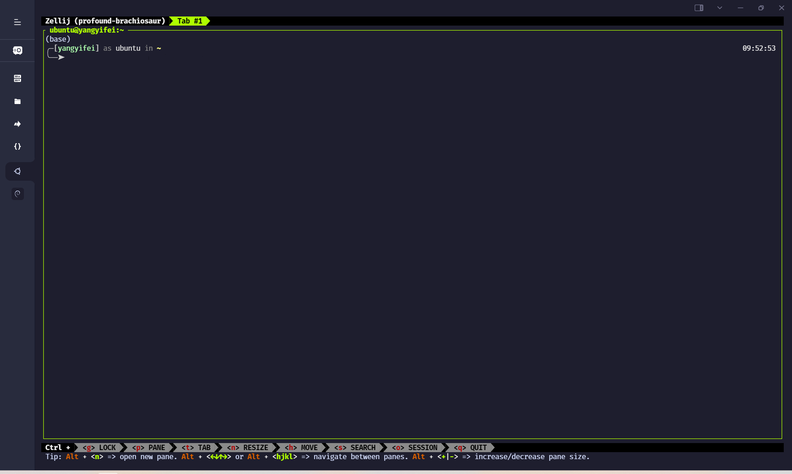

长期以来，我一直使用 `tmux` 作为各种 Linux 系统的终端复用器，但是由于懒得配置（这是主要原因）& 老是忘掉快捷键，使用始终算不上熟练。最近网上冲浪看见了 `Zellij` 这样一个用 Rust 写的终端复用器，就打算在自己的服务器虚拟机上折腾一下，体验一下看看究竟好不好用。

## 安装

用以测试的这台服务器可以正常联网，也有 `rust` 环境，所以我直接选择 `cargo` 安装。

```bash
cargo install --locked zellij
```

Zellij 目前并没有上 `apt` 。看官方文档好像上了 `pacman` 和 `nixpkgs`，如果好用的话在别的系统上进行配置的时候可以试试。

安装完成之后，类似于 `tmux`，直接在终端中运行

```bash
zellij
```

就可以开一个新的 session 了。



## 配置

在用户根目录生成对应的配置文件：

```bash
mkdir ~/.config/zellij
zellij setup --dump-config > ~/.config/zellij/config.kdl
```

以 [The KDL Document Language](https://kdl.dev/) 格式的配置文件就成功被生成了。刚开始使用没有改相关的 keybindings，主要就是改了主题和默认 shell 等等。

<details>
<summary> View config.yaml </summary>
```
// If you'd like to override the default keybindings completely, be sure to change "keybinds" to "keybinds clear-defaults=true"
keybinds {
    normal {
        // uncomment this and adjust key if using copy_on_select=false
        // bind "Alt c" { Copy; }
    }
    locked {
        bind "Ctrl g" { SwitchToMode "Normal"; }
    }
    resize {
        bind "Ctrl n" { SwitchToMode "Normal"; }
        bind "h" "Left" { Resize "Increase Left"; }
        bind "j" "Down" { Resize "Increase Down"; }
        bind "k" "Up" { Resize "Increase Up"; }
        bind "l" "Right" { Resize "Increase Right"; }
        bind "H" { Resize "Decrease Left"; }
        bind "J" { Resize "Decrease Down"; }
        bind "K" { Resize "Decrease Up"; }
        bind "L" { Resize "Decrease Right"; }
        bind "=" "+" { Resize "Increase"; }
        bind "-" { Resize "Decrease"; }
    }
    pane {
        bind "Ctrl p" { SwitchToMode "Normal"; }
        bind "h" "Left" { MoveFocus "Left"; }
        bind "l" "Right" { MoveFocus "Right"; }
        bind "j" "Down" { MoveFocus "Down"; }
        bind "k" "Up" { MoveFocus "Up"; }
        bind "p" { SwitchFocus; }
        bind "n" { NewPane; SwitchToMode "Normal"; }
        bind "d" { NewPane "Down"; SwitchToMode "Normal"; }
        bind "r" { NewPane "Right"; SwitchToMode "Normal"; }
        bind "x" { CloseFocus; SwitchToMode "Normal"; }
        bind "f" { ToggleFocusFullscreen; SwitchToMode "Normal"; }
        bind "z" { TogglePaneFrames; SwitchToMode "Normal"; }
        bind "w" { ToggleFloatingPanes; SwitchToMode "Normal"; }
        bind "e" { TogglePaneEmbedOrFloating; SwitchToMode "Normal"; }
        bind "c" { SwitchToMode "RenamePane"; PaneNameInput 0;}
    }
    move {
        bind "Ctrl h" { SwitchToMode "Normal"; }
        bind "n" "Tab" { MovePane; }
        bind "p" { MovePaneBackwards; }
        bind "h" "Left" { MovePane "Left"; }
        bind "j" "Down" { MovePane "Down"; }
        bind "k" "Up" { MovePane "Up"; }
        bind "l" "Right" { MovePane "Right"; }
    }
    tab {
        bind "Ctrl t" { SwitchToMode "Normal"; }
        bind "r" { SwitchToMode "RenameTab"; TabNameInput 0; }
        bind "h" "Left" "Up" "k" { GoToPreviousTab; }
        bind "l" "Right" "Down" "j" { GoToNextTab; }
        bind "n" { NewTab; SwitchToMode "Normal"; }
        bind "x" { CloseTab; SwitchToMode "Normal"; }
        bind "s" { ToggleActiveSyncTab; SwitchToMode "Normal"; }
        bind "b" { BreakPane; SwitchToMode "Normal"; }
        bind "]" { BreakPaneRight; SwitchToMode "Normal"; }
        bind "[" { BreakPaneLeft; SwitchToMode "Normal"; }
        bind "1" { GoToTab 1; SwitchToMode "Normal"; }
        bind "2" { GoToTab 2; SwitchToMode "Normal"; }
        bind "3" { GoToTab 3; SwitchToMode "Normal"; }
        bind "4" { GoToTab 4; SwitchToMode "Normal"; }
        bind "5" { GoToTab 5; SwitchToMode "Normal"; }
        bind "6" { GoToTab 6; SwitchToMode "Normal"; }
        bind "7" { GoToTab 7; SwitchToMode "Normal"; }
        bind "8" { GoToTab 8; SwitchToMode "Normal"; }
        bind "9" { GoToTab 9; SwitchToMode "Normal"; }
        bind "Tab" { ToggleTab; }
    }
    scroll {
        bind "Ctrl s" { SwitchToMode "Normal"; }
        bind "e" { EditScrollback; SwitchToMode "Normal"; }
        bind "s" { SwitchToMode "EnterSearch"; SearchInput 0; }
        bind "Ctrl c" { ScrollToBottom; SwitchToMode "Normal"; }
        bind "j" "Down" { ScrollDown; }
        bind "k" "Up" { ScrollUp; }
        bind "Ctrl f" "PageDown" "Right" "l" { PageScrollDown; }
        bind "Ctrl b" "PageUp" "Left" "h" { PageScrollUp; }
        bind "d" { HalfPageScrollDown; }
        bind "u" { HalfPageScrollUp; }
        // uncomment this and adjust key if using copy_on_select=false
        // bind "Alt c" { Copy; }
    }
    search {
        bind "Ctrl s" { SwitchToMode "Normal"; }
        bind "Ctrl c" { ScrollToBottom; SwitchToMode "Normal"; }
        bind "j" "Down" { ScrollDown; }
        bind "k" "Up" { ScrollUp; }
        bind "Ctrl f" "PageDown" "Right" "l" { PageScrollDown; }
        bind "Ctrl b" "PageUp" "Left" "h" { PageScrollUp; }
        bind "d" { HalfPageScrollDown; }
        bind "u" { HalfPageScrollUp; }
        bind "n" { Search "down"; }
        bind "p" { Search "up"; }
        bind "c" { SearchToggleOption "CaseSensitivity"; }
        bind "w" { SearchToggleOption "Wrap"; }
        bind "o" { SearchToggleOption "WholeWord"; }
    }
    entersearch {
        bind "Ctrl c" "Esc" { SwitchToMode "Scroll"; }
        bind "Enter" { SwitchToMode "Search"; }
    }
    renametab {
        bind "Ctrl c" { SwitchToMode "Normal"; }
        bind "Esc" { UndoRenameTab; SwitchToMode "Tab"; }
    }
    renamepane {
        bind "Ctrl c" { SwitchToMode "Normal"; }
        bind "Esc" { UndoRenamePane; SwitchToMode "Pane"; }
    }
    session {
        bind "Ctrl o" { SwitchToMode "Normal"; }
        bind "Ctrl s" { SwitchToMode "Scroll"; }
        bind "d" { Detach; }
        bind "w" {
            LaunchOrFocusPlugin "session-manager" {
                floating true
                move_to_focused_tab true
            };
            SwitchToMode "Normal"
        }
    }
    tmux {
        bind "[" { SwitchToMode "Scroll"; }
        bind "Ctrl b" { Write 2; SwitchToMode "Normal"; }
        bind "\"" { NewPane "Down"; SwitchToMode "Normal"; }
        bind "%" { NewPane "Right"; SwitchToMode "Normal"; }
        bind "z" { ToggleFocusFullscreen; SwitchToMode "Normal"; }
        bind "c" { NewTab; SwitchToMode "Normal"; }
        bind "," { SwitchToMode "RenameTab"; }
        bind "p" { GoToPreviousTab; SwitchToMode "Normal"; }
        bind "n" { GoToNextTab; SwitchToMode "Normal"; }
        bind "Left" { MoveFocus "Left"; SwitchToMode "Normal"; }
        bind "Right" { MoveFocus "Right"; SwitchToMode "Normal"; }
        bind "Down" { MoveFocus "Down"; SwitchToMode "Normal"; }
        bind "Up" { MoveFocus "Up"; SwitchToMode "Normal"; }
        bind "h" { MoveFocus "Left"; SwitchToMode "Normal"; }
        bind "l" { MoveFocus "Right"; SwitchToMode "Normal"; }
        bind "j" { MoveFocus "Down"; SwitchToMode "Normal"; }
        bind "k" { MoveFocus "Up"; SwitchToMode "Normal"; }
        bind "o" { FocusNextPane; }
        bind "d" { Detach; }
        bind "Space" { NextSwapLayout; }
        bind "x" { CloseFocus; SwitchToMode "Normal"; }
    }
    shared_except "locked" {
        bind "Ctrl g" { SwitchToMode "Locked"; }
        bind "Ctrl q" { Quit; }
        bind "Alt n" { NewPane; }
        bind "Alt i" { MoveTab "Left"; }
        bind "Alt o" { MoveTab "Right"; }
        bind "Alt h" "Alt Left" { MoveFocusOrTab "Left"; }
        bind "Alt l" "Alt Right" { MoveFocusOrTab "Right"; }
        bind "Alt j" "Alt Down" { MoveFocus "Down"; }
        bind "Alt k" "Alt Up" { MoveFocus "Up"; }
        bind "Alt =" "Alt +" { Resize "Increase"; }
        bind "Alt -" { Resize "Decrease"; }
        bind "Alt [" { PreviousSwapLayout; }
        bind "Alt ]" { NextSwapLayout; }
    }
    shared_except "normal" "locked" {
        bind "Enter" "Esc" { SwitchToMode "Normal"; }
    }
    shared_except "pane" "locked" {
        bind "Ctrl p" { SwitchToMode "Pane"; }
    }
    shared_except "resize" "locked" {
        bind "Ctrl n" { SwitchToMode "Resize"; }
    }
    shared_except "scroll" "locked" {
        bind "Ctrl s" { SwitchToMode "Scroll"; }
    }
    shared_except "session" "locked" {
        bind "Ctrl o" { SwitchToMode "Session"; }
    }
    shared_except "tab" "locked" {
        bind "Ctrl t" { SwitchToMode "Tab"; }
    }
    shared_except "move" "locked" {
        bind "Ctrl h" { SwitchToMode "Move"; }
    }
    shared_except "tmux" "locked" {
        bind "Ctrl b" { SwitchToMode "Tmux"; }
    }
}

plugins {
    tab-bar location="zellij:tab-bar"
    status-bar location="zellij:status-bar"
    strider location="zellij:strider"
    compact-bar location="zellij:compact-bar"
    session-manager location="zellij:session-manager"
    welcome-screen location="zellij:session-manager" {
        welcome_screen true
    }
    filepicker location="zellij:strider" {
        cwd "/"
    }
}

// Choose what to do when zellij receives SIGTERM, SIGINT, SIGQUIT or SIGHUP
// eg. when terminal window with an active zellij session is closed
// Options:
//   - detach (Default)
//   - quit
//
// on_force_close "quit"

//  Send a request for a simplified ui (without arrow fonts) to plugins
//  Options:
//    - true
//    - false (Default)
//
simplified_ui true

// Choose the path to the default shell that zellij will use for opening new panes
// Default: $SHELL
//
default_shell "zsh"

// Choose the path to override cwd that zellij will use for opening new panes
//
// default_cwd ""

// Toggle between having pane frames around the panes
// Options:
//   - true (default)
//   - false
//
pane_frames false

// Toggle between having Zellij lay out panes according to a predefined set of layouts whenever possible
// Options:
//   - true (default)
//   - false
//
// auto_layout true

// Whether sessions should be serialized to the cache folder (including their tabs/panes, cwds and running commands) so that they can later be resurrected
// Options:
//   - true (default)
//   - false
//
// session_serialization false

// Whether pane viewports are serialized along with the session, default is false
// Options:
//   - true
//   - false (default)
// serialize_pane_viewport true

// Scrollback lines to serialize along with the pane viewport when serializing sessions, 0
// defaults to the scrollback size. If this number is higher than the scrollback size, it will
// also default to the scrollback size. This does nothing if `serialize_pane_viewport` is not true.
//
// scrollback_lines_to_serialize 10000

// Define color themes for Zellij
// For more examples, see: https://github.com/zellij-org/zellij/tree/main/example/themes
// Once these themes are defined, one of them should to be selected in the "theme" section of this file
//
// themes {
//     dracula {
//         fg 248 248 242
//         bg 40 42 54
//         red 255 85 85
//         green 80 250 123
//         yellow 241 250 140
//         blue 98 114 164
//         magenta 255 121 198
//         orange 255 184 108
//         cyan 139 233 253
//         black 0 0 0
//         white 255 255 255
//     }
// }

// Choose the theme that is specified in the themes section.
// Default: default
//
theme "macchiato"

// The name of the default layout to load on startup
// Default: "default"
//
// default_layout "compact"

// Choose the mode that zellij uses when starting up.
// Default: normal
//
// default_mode "locked"

// Toggle enabling the mouse mode.
// On certain configurations, or terminals this could
// potentially interfere with copying text.
// Options:
//   - true (default)
//   - false
//
// mouse_mode false

// Configure the scroll back buffer size
// This is the number of lines zellij stores for each pane in the scroll back
// buffer. Excess number of lines are discarded in a FIFO fashion.
// Valid values: positive integers
// Default value: 10000
//
// scroll_buffer_size 10000

// Provide a command to execute when copying text. The text will be piped to
// the stdin of the program to perform the copy. This can be used with
// terminal emulators which do not support the OSC 52 ANSI control sequence
// that will be used by default if this option is not set.
// Examples:
//
// copy_command "xclip -selection clipboard" // x11
// copy_command "wl-copy"                    // wayland
// copy_command "pbcopy"                     // osx

// Choose the destination for copied text
// Allows using the primary selection buffer (on x11/wayland) instead of the system clipboard.
// Does not apply when using copy_command.
// Options:
//   - system (default)
//   - primary
//
// copy_clipboard "primary"

// Enable or disable automatic copy (and clear) of selection when releasing mouse
// Default: true
//
// copy_on_select false

// Path to the default editor to use to edit pane scrollbuffer
// Default: $EDITOR or $VISUAL
//
// scrollback_editor "/usr/bin/vim"

// When attaching to an existing session with other users,
// should the session be mirrored (true)
// or should each user have their own cursor (false)
// Default: false
//
// mirror_session true

// The folder in which Zellij will look for layouts
//
// layout_dir "/path/to/my/layout_dir"

// The folder in which Zellij will look for themes
//
// theme_dir "/path/to/my/theme_dir"

// Enable or disable the rendering of styled and colored underlines (undercurl).
// May need to be disabled for certain unsupported terminals
// Default: true
//
// styled_underlines false

// Enable or disable writing of session metadata to disk (if disabled, other sessions might not know
// metadata info on this session)
// Default: false
//
// disable_session_metadata true

```
</details>
```

由于默认配置需要 `Nert fonts`，但是我觉得没必要，于是我就开启 `simplified-ui true` ，极简模式也挺好23333

## 使用

如果需要在 zsh 中默认启动 zellij，只需运行

```bash
echo 'eval "$(zellij setup --generate-auto-start zsh)"' >> ~/.zshrc
```

将启动命令写入启动脚本中。

